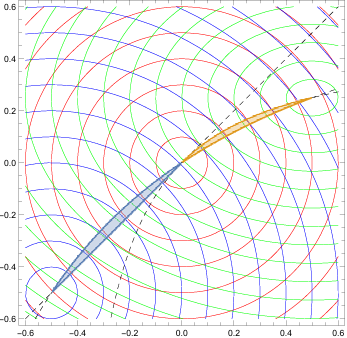

What is Bézier simplex fitting?
================================

You are probably familiar with Bézier curves (1-D) and Bézier triangles (2-D) from computer graphics and CAD software.
A **Bézier simplex** is their natural generalization to any number of dimensions: the same elegant polynomial construction, extended to an :math:`(M-1)`-dimensional surface defined over a standard simplex.

At its core, **Bézier simplex fitting is a general-purpose regression technique**. Just as a regular Bézier curve smoothly interpolates or approximates a 1-D point cloud using a small set of *control points*, a Bézier simplex can approximate any continuous map from a standard simplex to a high-dimensional Euclidean space. Given a point cloud dataset defined over simplex coordinates, it can fit a highly flexible and mathematically well-behaved parametric surface to the data.

This page introduces the formal definition of Bézier simplices, the least-squares fitting algorithm used by PyTorch-BSF, and its most prominent real-world applications.

Bezier simplex
--------------

Let :math:`D, M, N` be nonnegative integers, :math:`\mathbb N` the set of nonnegative integers (including zero!), and :math:`\mathbb R^N` the :math:`N`-dimensional Euclidean space.
We define the *index set* by

.. math:: \mathbb N_D^M = \left\{\mathbf d=(d_1,\ldots,d_M)\in\mathbb N^M\ \Bigg|\ \sum_{m=1}^M d_m=D\right\},

and the *simplex* by

.. math:: \Delta^{M-1} = \left\{\mathbf t=(t_1,\ldots,t_M)\in[0,1]^M\ \Bigg|\ \sum_{m=1}^M t_m=1\right\}.

An :math:`(M-1)`-dimensional *Bezier simplex* of degree :math:`D` in :math:`\mathbb R^N` is a polynomial map :math:`\mathbf b: \Delta^{M-1}\to\mathbb R^N` defined by

.. math:: \mathbf b(\mathbf t\mid\mathbf p) = \sum_{\mathbf d\in\mathbb N_D^M} \binom{D}{\mathbf d} \mathbf t^{\mathbf d} \mathbf p_{\mathbf d},

where :math:`\mathbf t^{\mathbf d} = t_1^{d_1} t_2^{d_2}\cdots t_M^{d_M}`, :math:`\binom{D}{\mathbf d}=D! / (d_1!d_2!\cdots d_M!)`, and :math:`\mathbf p_{\mathbf d}\in\mathbb R^N\ (\mathbf d\in\mathbb N_D^M)` are parameters called the *control points*.

.. image:: _static/bezier-simplex.png
   :width: 33%
   :align: center
   :alt: A Bezier simplex and its control points

Fitting a Bezier simplex to a dataset
-------------------------------------

Assume we have a finite dataset :math:`B\subset\Delta^{M-1}\times\mathbb R^N` and want to fit a Bezier simplex to the dataset.
What we are trying can be formulated as a problem of finding the best vector of control points :math:`\mathbf p=(\mathbf p_{\mathbf d})_{\mathbf d\in\mathbb N_D^M}` that minimizes the least square error between the Bezier simplex and the dataset:

.. math:: \arg\min_{\mathbf p} \sum_{(\mathbf t,\mathbf x)\in B}\|\mathbf b(\mathbf t\mid\mathbf p)-\mathbf x\|^2.

PyTorch-BSF provides an algorithm for solving this optimization problem with the L-BFGS algorithm.

.. image:: _static/bezier-simplex-fitting.png
   :width: 66%
   :align: center
   :alt: A Bezier simplex that fits to a dataset

Why does Bézier simplex fitting matter?
----------------------------------------

While Bézier simplex fitting serves as a general-purpose tool to approximate any continuous mapping defined on a simplex, one of its most transformative applications lies in **multi-objective optimization**.

In multi-objective optimization, the **Pareto front** — the set of all optimal trade-off solutions — is rarely a single point; it is a continuous surface. 
Crucially, for a broad and theoretically grounded class of problems known as **weakly simplicial problems**, the Pareto set and Pareto front are topologically equivalent to a simplex and can be accurately approximated by a Bézier simplex.

This leads to a powerful practical methodology: instead of attempting an exhaustive and computationally expensive grid search over all possible weight configurations, you can solve the optimization problem for a very small, structurally chosen set of weights. By applying Bézier simplex fitting to those few exact solutions, you can extrapolate and evaluate the continuous parametric surface to *read off* the entire Pareto front at negligible computational cost.

Approximation theorem
^^^^^^^^^^^^^^^^^^^^^

Any continuous map from a simplex to a Euclidean space can be approximated by a Bezier simplex.
More precisely, the following theorem holds [1]:

**Theorem (Approximation by Bézier Simplex):**
For any continuous map :math:`f: \Delta^{M-1} \to \mathbb{R}^N` and any :math:`\epsilon > 0`, there exists a degree :math:`D` and control points :math:`\mathbf{p}` such that the Bézier simplex :math:`\mathbf{b}(\mathbf{t} \mid \mathbf{p})` satisfies :math:`\max_{\mathbf{t} \in \Delta^{M-1}} \| f(\mathbf{t}) - \mathbf{b}(\mathbf{t} \mid \mathbf{p}) \| < \epsilon`.

This guarantees that Bézier simplices are universal approximators for any continuous simplex-domain function.

Weakly simplicial problems and Strongly convex problems
^^^^^^^^^^^^^^^^^^^^^^^^^^^^^^^^^^^^^^^^^^^^^^^^^^^^^^^

**Definition (Weakly Simplicial Problem):**
A multi-objective optimization problem is called *weakly simplicial* if there exists a continuous surjective map from a standard simplex onto the Pareto set and Pareto front, such that the image of any subsimplex (a lower-dimensional face of the simplex) exactly coincides with the Pareto set and Pareto front of the corresponding subproblem [3].

.. image:: _static/simplicial-problem.png
   :width: 66%
   :align: center
   :alt: A simplicial problem: the Pareto set and Pareto front are homeomorphic to a simplex, i.e., they have no pinched topology.

Such a well-structured continuous map uniquely arises in continuous multi-objective optimization.
A profound theoretical result is that **all unconstrained strongly convex problems are weakly simplicial** [3]. This guarantees that for strongly convex models, their Pareto fronts admit a simplex structure and can be efficiently reconstructed using Bézier simplex fitting.

Application 1: Elastic net model selection
------------------------------------------

A canonical and highly practical application of this theory is hyperparameter optimization for the **Elastic Net**.
The elastic net objective combines L1 and L2 regularization parameterized by two coefficients: :math:`\lambda` (overall strength) and :math:`\alpha` (L1/L2 balance). When appropriately parameterized, these coefficients span a 2-simplex.

Because the elastic net problem is unconstrained and strongly convex, it is guaranteed to be weakly simplicial [3].
Rather than training thousands of models in a grid search over all :math:`(\lambda, \alpha)` combinations, you can train the Elastic Net on a sparse subset of simplex-structured weight vectors. Fitting a Bézier simplex to the resulting trained models yields a continuous performance surface. This allows practitioners to instantly explore the full continuous spectrum of model hyperparameters and locate the statistically optimal model analytically, without any further retraining.

Weighted-sum scalarization and solution map
^^^^^^^^^^^^^^^^^^^^^^^^^^^^^^^^^^^^^^^^^^^

The *weighted-sum scalarization* :math:`x^*: \Delta^{M-1}\to\mathbb R^N` defined by

.. math:: x^*(w)=\arg\min_x \sum_{m=1}^M w_m f_m(x).

We define the *solution map* :math:`(x^*,f\circ x^*):\Delta^{M-1}\to G^*(f)` by

.. math:: (x^*,f\circ x^*)(w)=(x^*(w),f(x^*(x))).

The solution map is continuous and surjective.
See [3] for technical details.

Application 2: Deep neural networks
------------------------------------

Training a GAN involves balancing multiple competing losses.
For consistency-regularized GANs (bCR / zCR), the generator and discriminator objectives combine several loss terms whose relative weights form a simplex structure.
Fitting a Bézier simplex to solutions sampled across this simplex reveals the full trade-off surface without re-training from scratch for each configuration.

Concretely, the discriminator and generator losses are defined as

.. math::

   L_D^\mathrm{bCR}&=L_D+\lambda_\mathrm{real}L_\mathrm{real}+\lambda_\mathrm{fake}L_\mathrm{fake},

   L_D&=D(G(z))-D(x),

   L_\mathrm{real}&=\|D(x)-D(T(x))\|^2,

   L_\mathrm{fake}&=\|D(G(z))-D(T(G(z)))\|^2,

   L_D^\mathrm{zCR}&=L_D+\lambda_\mathrm{dis}L_\mathrm{dis},

   L_G^\mathrm{zCR}&=L_G+\lambda_\mathrm{gen}L_\mathrm{gen},

   L_G&=-D(G(z)),

   L_\mathrm{dis}&=\|D(G(z))-D(G(T(z)))\|^2,

   L_\mathrm{gen}&=\|G(z)-G(T(z))\|^2.

Statistical test for weakly simpliciality
^^^^^^^^^^^^^^^^^^^^^^^^^^^^^^^^^^^^^^^^^

When the problem class is not known in advance, it is not clear whether the Pareto set admits a simplex structure.
A data-driven statistical test [4] can determine whether this assumption is warranted before committing to a Bézier simplex model.
See [4] for the methodology and test statistics.

References
----------
1. Kobayashi, K., Hamada, N., Sannai, A., Tanaka, A., Bannai, K., & Sugiyama, M. (2019). Bézier Simplex Fitting: Describing Pareto Fronts of Simplicial Problems with Small Samples in Multi-Objective Optimization. Proceedings of the AAAI Conference on Artificial Intelligence, 33(01), 2304-2313. https://doi.org/10.1609/aaai.v33i01.33012304
2. Tanaka, A., Sannai, A., Kobayashi, K., & Hamada, N. (2020). Asymptotic Risk of Bézier Simplex Fitting. Proceedings of the AAAI Conference on Artificial Intelligence, 34(03), 2416-2424. https://doi.org/10.1609/aaai.v34i03.5622
3. Mizota, Y., Hamada, N., & Ichiki, S. (2021). All unconstrained strongly convex problems are weakly simplicial. arXiv:2106.12704 [math.OC]. https://arxiv.org/abs/2106.12704
4. Hamada, N. & Goto, K. (2018). Data-Driven Analysis of Pareto Set Topology. Proceedings of the Genetic and Evolutionary Computation Conference, 657-664. https://doi.org/10.1145/3205455.3205613
